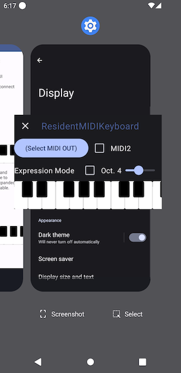
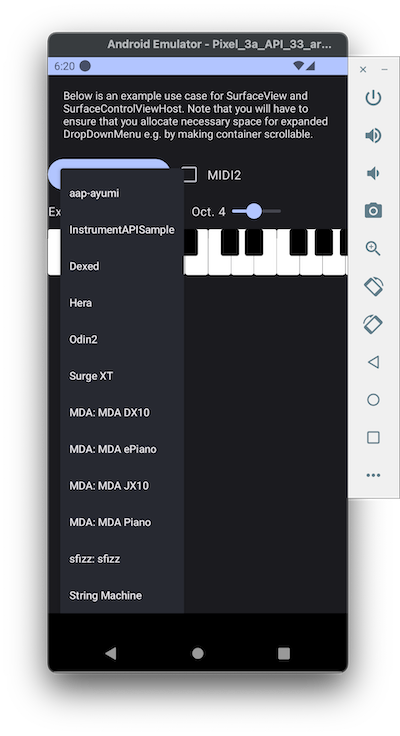
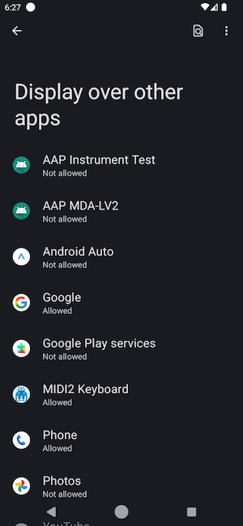

# ResidentMIDIKeyboard for Android

ResidentMIDIKeyboard for Android is a virtual MIDI keyboard application for Android. It supports MIDI 1.0 and 2.0 (June 2023 Updates, in "almost" standard compliant way).

It supports "Expression Mode": instead of switching keys on the dragged loations, we can send pitchbend messages for horizontal dragging, per-note pitchbend messags for vertical dragging, and polyphonic (key) pressures for pressure changes on the device.

(Note: per-note pitchbend works only on MIDI2 mode, and even on MIDI2 mode there is not really a MIDI device that supports per-note pitchbend, as far as @atsushieno knows as of July 2023.)

There are 3 ways to use the app (actually two for users; one for app developers):

- Using the app: it barely makes sense, but launch the main activity that comes with the keyboard.
- As a System Alert Window: you need to approve the UI overlay permission (it is usually dangerous as an app could show deceitful UI like a password box for your bank while you are running a banking app, so Android system explicitly asks the user to identify that the app is not malicious), use it anytime e.g. over your Home Launcher, or over any DAW.
- As a [SurfaceControlViewHost](https://developer.android.com/reference/android/view/SurfaceControlViewHost): it is not for user, but for developers. We provide a public GUI service `org.androidaudioplugin.residentmidikeyboard.MidiKeyboardViewService`.

## Basic Design Concept

The app is primarily intended to meet all these conditions:

- a MIDI client that works anywhere System Alert Window works
- supports both MIDI 1.0 and 2.0 (as long as possible)
- makes use of mobile features such as multi-touches and follows mobile design principles

My primary reasoning for this app is that I do not want to embed a MIDI functionality test stuff on our [AAP (Audio Plugins For Android)](https://github.com/atsushieno/aap-core) plugin manager UI.

## ResidentMidiKeyboard as System Alert Window

When the app is launched, it shows a foreground nofitication that contains "Show", "Hide" and "Switch to App" links. When you perform "Show" command, the System Alert Window keyboard should show up.

Note that you have to explicitly permit UI overlay on Settings in prior.

## MidiKeyboardViewService

`SurfaceControlViewHost` lets developers (not end users) achieve "embedded remote UI" which works like RemoteViews but with much less limitation. Basically anything you can render on a `SurfaceView` can be implemented on the service side, and UI interaction is possible. ResidentMidiKeyboard uses Jetpack Compose, which can be also transferred.

To embed our MIDI keyboard, you do not have to add reference to our library; you only have to install ResidentMidiKeyboard app, and write some client code that binds `org.androidaudioplugin.residentmidikeyboard.MidiKeyboardViewService` just like ordinary Android `Service`.

### The Service Protocol Details

This service receives `Message` i.e. any `Intent` with certain key-value bundles. The required items are:

| Key | Type | Role |
|-|-|-|
| "opcode" | Int | `0` for connecting, `1` for disconnecting |
| "hostToken" | Binder | the host token: get from `SurfaceView.hostToken` |
| "displayId" | Int | the display ID: get from `SurfaceView.display.displayId` |
| "width" | Int | initial width e.g. from `SurfaceView.width` |
| "height" | Int | initial height e.g. from `SurfaceView.height` |

The `MainActivity` comes with an example embedded `SurfaceView` with makes use of `MidiKeyboardSurfaceControlClient` class. (You can reuse it too.)

It is highly encouraged to ensure that you use it as an optional add-in feature; it is always possible to embed the control your own app by just using [ComposeAudioControls](https://github.com/atsushieno/compose-audio-controls/) library (`compose-audio-controls-midi` module).

Note that you will have to ensure that you allocate necessary space for expanded DropDownMenu e.g. by making container scrollable. It is one of the common Jetpack Compose issues (or tricks) regarding how to use it appropriately on a custom View.

## MIDI 2.0 support

There is a checkbox option that enables MIDI 2.0. Once you check it, it will send any MIDI messages as MIDI 2.0 UMP messages instead of MIDI 1.0 bytes stream. Note that most of your MIDI output devices ("input devices" in Android MIDI API wording) do not support MIDI 2.0 as of July 2023.

[AAP (Audio Plugins For Android)](https://github.com/atsushieno/aap-core) MidiDeviceServices support these MIDI 2.0 UMPs and this MIDI2 mode works with them. You can install those AAP instrument plugins via [AAP APK Installer](https://github.com/atsushieno/android-ci-package-installer).

### MIDI 2.0 mode bootstrap process

When you check "MIDI2" box, it sends UMP "Stream Configuration Request" message that asks the destination to switch to MIDI 2.0 protocol. Let me emphasize: it sends a UMP message. Note that the recipient should be *already* capable of receiving UMP, which usually does not happen on most Android MIDI API devices. 

(The latest MIDI 2.0 specification probably expects that the MIDI 2.0 output port ("input port" in Android MIDI API wording) should be distinct from that of MIDI 1.0 output port, but there is no such Android MIDI API that makes it work as such yet. So, everything is basically based on a hackable assumption on Android platform up to Android 14.)

Also note that since we do NOT really pair the output device with its expected input devices for bidirectional messaging, the expected reply (Stream Configuration Notification message) that would be sent by the recipient is *ignored*. If the recipient fails if no input port exists, then the device is not feasible for us (I should probably state, *we are* not feasible for them).

### Hacking ResidentMIDIKeyboard

We submodule [compose-audio-controls](https://github.com/atsushieno/compose-audio-controls/) for convenience, as we most likely depend on unpublished features that are only on `main` branch without release tags. Our project (as in `settings.gradle.kts`) references those modules in the git submodule directly, instead of depending on `mavenLocal()`.

The same could go for [ktmidi](https://github.com/atsushieno/ktmidi/), but it is so far referenced in packages.

## Licenses

ResidentMidiKeyboard code is released under the MIT license.

It contains an application icon that is a derived work of [Material Design 3 Icons](https://m3.material.io/styles/icons/overview) which are released under the Apache V2 License.

ResidentMidiKeyboard makes use of [jeziellago/compose-markdown](https://github.com/jeziellago/compose-markdown) which is released under the MIT license.
